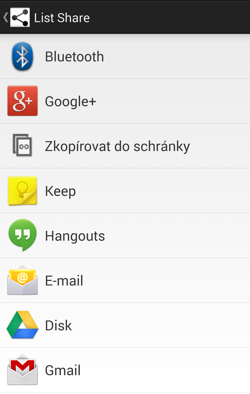
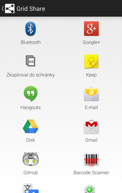

ShareFragments
==============

Share simple data to other apps using Android Fragments

Info
----

On Android you can send simple data to other apps using [system dialog][1] (a "chooser") or by using [easy share action][2].
If you want to share data using Fragments, you have no ready to use way. That's purpose of this library.

I would like to encourage all Android developers to prefer full-screen to nasty dialogs. More explanation by Roman Nurik [here][3].

License
=======

    Copyright 2014 Ondřej Kroupa

    Licensed under the Apache License, Version 2.0 (the "License");
    you may not use this file except in compliance with the License.
    You may obtain a copy of the License at

       http://www.apache.org/licenses/LICENSE-2.0

    Unless required by applicable law or agreed to in writing, software
    distributed under the License is distributed on an "AS IS" BASIS,
    WITHOUT WARRANTIES OR CONDITIONS OF ANY KIND, either express or implied.
    See the License for the specific language governing permissions and
    limitations under the License.

[1]: http://developer.android.com/training/sharing/send.html
[2]: http://developer.android.com/training/sharing/shareaction.html
[3]: http://ux.stackexchange.com/a/15358/35992